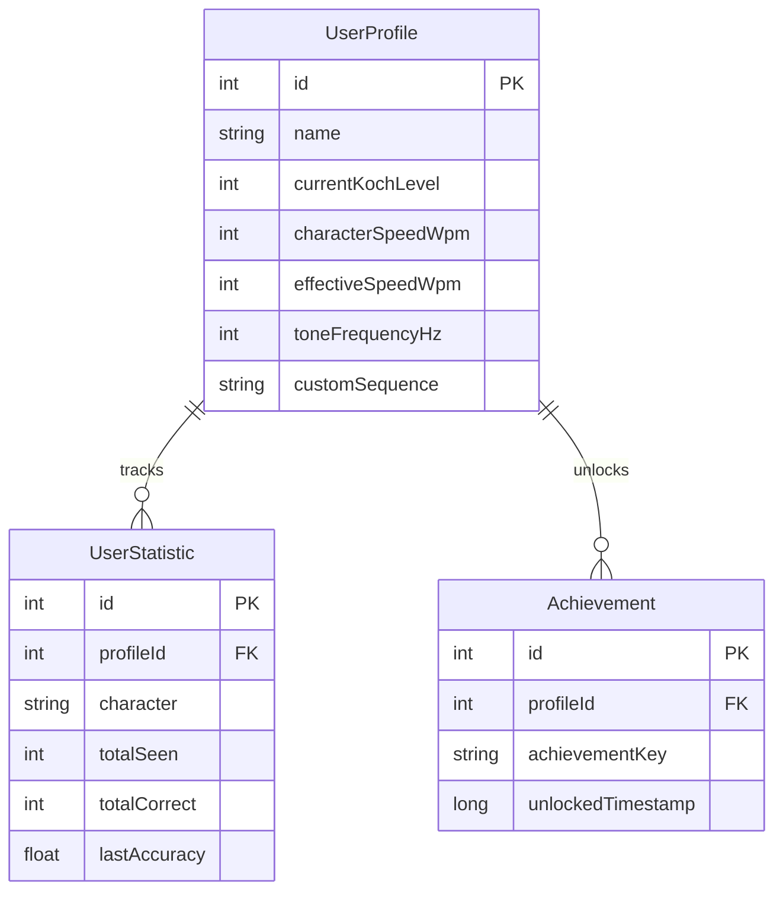
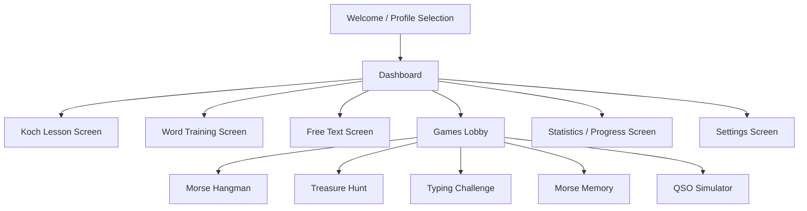

# Morse Trainer - Implementation Recommendations

This document outlines the architectural design, technology stack, and implementation strategies for building the **Morse Trainer** Android application as described in [requirements.md](file:///c:/Users/peter/AndroidStudioProjects/MorseTrainer/requirements.md).

---

## 1. System Architecture

A clean, modular architecture based on modern Android development guidelines (MVVM + Clean Architecture principles) is recommended. This decouples the UI from the audio synthesis and the learning logic, facilitating unit testing and maintainability.

```mermaid
graph TD
    subgraph UI Layer (Jetpack Compose)
        ComposeUI[Compose Screens] --> ViewModels[ViewModels]
    end

    subgraph Domain/Business Layer
        ViewModels --> KochEngine[Koch Progression Engine]
        ViewModels --> AudioEngine[Morse Audio Engine]
        ViewModels --> GameEngines[Game Logic Controllers]
    end

    subgraph Data Layer
        KochEngine --> RoomDB[Room SQLite Database]
        GameEngines --> RoomDB
        ViewModels --> DataStore[Preferences DataStore]
        RoomDB --> BackupService[JSON/CSV Export & Import]
    end
```

### Architectural Component Breakdown

1. **UI Layer (Jetpack Compose & Material 3):**
   * Declares the visual screens and components.
   * Views react to StateFlow or SharedFlow emitted by ViewModels.
   * Leverages Material 3 tokens for dynamic, modern, and adaptive coloring.
2. **ViewModel Layer:**
   * Holds UI state and handles user interaction logic.
   * Communicates with Domain engines using Coroutines.
3. **Domain Layer:**
   * **Morse Audio Engine:** Handles real-time synthesis of Morse signals, adding envelopes, and playing sound.
   * **Koch Progression Engine:** Calculates accuracy rates, decides when to promote a student to the next character, and customizes character distribution.
   * **Game Logic Controllers:** Manages state for individual games (Hangman, Memory, QSO Simulator).
4. **Data Layer:**
   * **Room DB:** Stores persistent learner profiles, lesson progress, detailed statistics per character, and unlocked achievements.
   * **Preferences DataStore:** Manages light-weight configurations like tone volume, character speed, and current selected profile ID.

---

## 2. Core Technical Challenges & Recommended Solutions

### 2.1 Audio Synthesis (Dynamic Morse Generation)
Android's `AudioTrack` API is ideal for writing raw PCM audio data buffer-by-buffer, which avoids reading heavy pre-rendered audio files and enables real-time adjustments (frequency, speed, Farnsworth spacing).

#### Click Prevention (Envelope Shaping)
Turning a pure sine wave on and off instantly creates an audible "click" (transient high-frequency noise), which causes listening fatigue. We recommend applying a raised-cosine or linear ramp-up and ramp-down envelope (typically 5ms to 10ms) to the beginning and end of each tone.

```kotlin
// Example PCM generation for a dot/dash with 5ms rise/fall envelope
fun generateToneBuffer(
    frequency: Double, 
    durationMs: Int, 
    sampleRate: Int = 44100,
    rampMs: Int = 5
): ShortArray {
    val totalSamples = (sampleRate * (durationMs / 1000.0)).toInt()
    val rampSamples = (sampleRate * (rampMs / 1000.0)).toInt()
    val buffer = ShortArray(totalSamples)
    
    for (i in 0 until totalSamples) {
        val sineValue = Math.sin(2.0 * Math.PI * frequency * i / sampleRate)
        val amplitude = when {
            i < rampSamples -> {
                // Rise envelope (raised cosine)
                0.5 * (1.0 - Math.cos(Math.PI * i / rampSamples))
            }
            i > totalSamples - rampSamples -> {
                // Fall envelope (raised cosine)
                val remaining = totalSamples - i
                0.5 * (1.0 - Math.cos(Math.PI * remaining / rampSamples))
            }
            else -> 1.0
        }
        buffer[i] = (sineValue * amplitude * Short.MAX_VALUE).toInt().toShort()
    }
    return buffer
}
```

#### WPM and Farnsworth Spacing Calculations
* **Standard Speed (WPM):** The standard "PARIS" word is used to calibrate speed. One dot unit duration $T$ in seconds is calculated as:
  $$T = \frac{1.2}{\text{WPM}}$$
  * Dash = $3T$
  * Element space = $1T$
  * Character space = $3T$
  * Word space = $7T$
* **Farnsworth Spacing:** Keeps character speed fast (e.g., 20 WPM $\implies T = 60\text{ ms}$ for character symbols) but widens character spacing and word spacing to match a slower effective speed (e.g., 10 WPM). 
  * The total duration of symbols inside the word "PARIS" is kept constant.
  * The extra spacing duration is distributed proportionally to character gaps and word gaps.

#### Audio Simulation Profiles (Advanced)
* **QSB (Fading):** Modulate the volume amplitude envelope using a low-frequency oscillator (LFO) or random walk function over time.
* **Background Noise & QRM:** Add random white noise or auxiliary weak sine waves (slightly detuned, e.g., offset by $\pm 100\text{ Hz}$) to the synthesized output buffer before playing.

---

### 2.2 Database Selection & Schema Design
We recommend using **Room Database** as it is the standard, compile-time verified database framework for Android. 

#### Recommended Schema Entity Diagram



#### Room Migration & Offline Synchronization
* Maintain SQL schema versions carefully.
* Since the app must work **offline**, progress tracking will run purely on Room. 
* To support **Backup and Restore**, Room models can be serialized to a JSON payload using the `kotlinx.serialization` library and written/read from local storage using Android SAF (Storage Access Framework).

---

## 3. UI/UX Structure & Navigation

Using **Jetpack Navigation for Compose**, we recommend structuring the screens sequentially and adopting a premium dark mode by default. Dark mode reduces screen glare and aligns with the aesthetic of desktop radio transceivers.



### UI Recommendations for Learning Morse
1. **Interactive Audio Visualizer:** Show a real-time waveform or waterfall layout when Morse signals are playing. This adds a "premium" software-defined radio feel.
2. **Haptic Feedback:** Provide subtle vibration feedback (using Android's `Vibrator` class) synchronous to the dots/dashes to enable tactile learning alongside auditory learning.
3. **Optimized Typing Input:** In the Koch Lesson screen, display a clean grid of candidate characters or a specialized visual keyboard highlighting only the characters learned so far. This minimizes key hunt time for beginner users.

---

## 4. Implementation Phase Plan

To build this systematically, we suggest dividing the work into 4 logical phases:

### Phase 1: Foundation (Core Engines & Database)
* Implement the Room SQLite database, DAO interfaces, and User Profile entities.
* Develop the Kotlin `MorseAudioEngine` wrapping `AudioTrack` and verifying ramp envelopes, WPM speed calculations, and basic playback commands.
* Build the `KochProgressionEngine` logic (accuracy tracking, promotion checks, custom sequences).
* *Verification:* Run Kotlin unit tests comparing expected dot/dash sound durations against synthesized samples.

### Phase 2: Core Learning Modes (UI)
* Set up Navigation and Compose theme (Material 3).
* Design user profile selection.
* Build the **Koch Lesson Mode** screen with sound playback, character input fields, immediate visual feedback, and transition animations.
* Develop the **Word Training Mode** and **Free Text Training** screens.

### Phase 3: Gamification & Simulators
* Implement game state logic for:
  * **Morse Hangman:** Word templates and audio clue delivery.
  * **Typing Challenge:** A scrolling layout where letters must be typed before sliding out.
  * **Morse Memory:** Flipping cards matching audio/text/symbols.
  * **QSO Simulator:** State machine representing standard amateur radio contacts.

### Phase 4: Polish, Stats, and Export
* Build user statistics screen with custom Canvas-drawn charts (accuracy trends, speed, and character mastery).
* Add achievement triggers (unlocking badges).
* Add CSV/JSON backup, restoring, and sharing.
* Run profile tests to check memory/audio rendering overhead.
